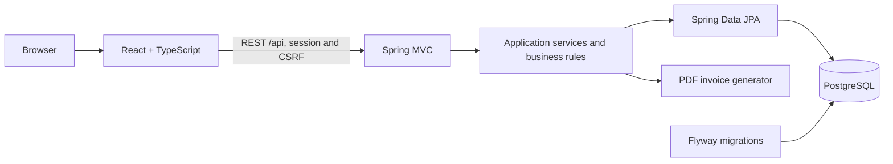

# Mietek Customs — Car Workshop Management System

<p align="center">
  
</p>

A full-stack portfolio application for managing a car workshop. Customers can manage
their vehicles and request appointments, mechanics handle repairs from acceptance to
pickup, and administrators configure workshop availability and user accounts.

The project demonstrates practical use of Spring Boot, a relational database, session
security, transactional concurrency control, integration testing, and React with
TypeScript. The application interface is in Polish, while source code and API messages
use English naming.

**Quick navigation:** [Features](#features) · [Application flow](#application-flow) ·
[Technology stack](#technology-stack) · [Architecture](#architecture) ·
[Getting started](#getting-started) · [Demo accounts](#demo-accounts) ·
[Deployment](#production-deployment) · [Decisions and limitations](#decisions-and-limitations) ·
[Documentation](#documentation)

## Features

| Role | Capabilities |
| --- | --- |
| Customer | Personal or company profile, owned vehicles, appointment requests, repair history, and PDF invoices |
| Guest | Appointment request without creating an account |
| Mechanic | Weekly schedule, request handling, labor and parts, repair completion, and vehicle pickup |
| Administrator | Mechanic capabilities, schedule configuration, and customer/staff account management |

The application also provides a public workshop service catalog managed by mechanics
and administrators.

## Application flow

Example scenario: a customer reports a braking problem, the workshop accepts the car,
performs the repair, and records the pickup. The completed repair appears in the vehicle
history with a downloadable PDF invoice. The screenshots use records prepared by the
local demo-data profile.

**Request → confirmation → repair → pickup and invoice**

### 1. Customer requests an appointment

The customer selects an owned vehicle, an available drop-off day, and describes the
problem. The request receives the `PENDING` status. The backend validates availability
again inside the write transaction to prevent the daily capacity from being exceeded.


### 2. Workshop reviews the requested date

The mechanic sees active requests on the weekly schedule. Staff can confirm or reject a
request, or propose another available day. A logged-in customer accepts the proposed day
from the “My appointments” page.


### 3. Mechanic records the completed repair

The mechanic enters a work summary and separate labor and part items. The backend
calculates the final gross amount and moves the request to `READY_FOR_PICKUP`. Payment is
handled at the workshop outside the application.


### 4. Customer picks up the vehicle and downloads the invoice

Staff marks the vehicle as picked up, changing the status to `COMPLETED`. The repair then
appears in the vehicle history. The invoice snapshot and generated PDF are persisted, so
later profile, logo, or pricing changes do not modify an issued document.


## Technology stack

- **Backend:** Java 25, Spring Boot 4.1.1, Spring MVC, Spring Data JPA, Spring Security
- **Database:** PostgreSQL 17, Hibernate, Flyway
- **Frontend:** React 19.2.8, TypeScript 6.0.2, Vite 8.2.2, React Router 7.18.3
- **Testing:** JUnit/Jupiter, MockMvc, AssertJ, Testcontainers, Vitest, React Testing Library
- **Tooling:** Maven, Docker Compose, GitHub Actions, springdoc-openapi 3.1.1, OpenPDF 2.4.0

## Architecture



The backend is a modular monolith organized by business capability. Spring Security uses
server-side sessions with HttpOnly cookies, while state-changing requests require CSRF
protection.

## Key technical highlights

- Profile, vehicle, appointment, and document ownership is derived from the authenticated
  account ID rather than identifiers supplied by the browser.
- `CLIENT`, `MECHANIC`, and `ADMIN` permissions are enforced by the backend.
- Transactional PostgreSQL locks protect appointment capacity against concurrent bookings
  and schedule-configuration changes.
- Appointment and account lists provide backend pagination, filtering, and sorting.
- Flyway versions the database schema; the `local` profile creates demo data idempotently.
- Repair items use `BigDecimal`; invoice totals are calculated per line as net, VAT, and gross.
- Issued invoice data and the generated PDF are persisted as an immutable snapshot.
- The API exposes a consistent error format with stable technical error codes.
- Integration tests run against an isolated PostgreSQL instance through Testcontainers.

## Decisions and limitations

The project uses a modular monolith because the current scope does not justify the
operational cost of microservices. Session-based Spring Security with CSRF matches a
single web application and avoids introducing JWT without a concrete requirement. The
backend remains the source of truth for authorization, schedule capacity, repair totals,
and persisted invoice data.

The repository contains a production-oriented deployment variant, but no public instance
or domain is maintained. The application does not include online payments, accounting
corrections, e-mail/SMS notifications, automatic password recovery, or assignment of jobs
to individual mechanics. The public booking form does not yet have rate limiting. Invoice
documents and workshop address data are demonstrational and are not presented as a
complete legally compliant accounting system.

## Roadmap

The core portfolio scope is complete. Possible next steps include rate limiting for public
forms, notification delivery, request tracing and audit logging, and more advanced workshop
resource planning. Full accounting and online payments would remain separate integrations.

## Getting started

Requirements:

- Docker Desktop using Linux containers
- Docker Compose 2.20.3 or newer

From the repository root, run:

```powershell
docker compose up --build -d --wait
```

| Component | URL |
| --- | --- |
| Application | http://localhost:5173 |
| Swagger UI | http://localhost:8080/swagger-ui.html |
| Backend health check | http://localhost:8080/api/health |

Stop the application while preserving the database volume:

```powershell
docker compose down
```

## Production deployment

`compose.production.yaml` builds a static React frontend served by Nginx. Caddy acts as
the public reverse proxy and automatically configures HTTPS for a valid domain. The
`production` Spring profile does not seed demo data, disables Swagger, enables secure
session-cookie defaults, and creates the first administrator from environment variables.

Domain configuration, secrets, and the first deployment are described in the
[deployment guide](docs/deployment-guide.md). `.env.production.example` is only a
template; the real `.env.production` file is ignored by Git.

## Demo accounts

The `local` Spring profile used by Docker Compose provides these accounts:

| Username | Password | Role |
| --- | --- | --- |
| `anna.demo` | `client-local-2026` | Customer with vehicles, appointments, and an invoice |
| `firma.demo` | `client-local-2026` | Company customer with a company invoice |
| `mechanic` | `mechanic-local-2026` | Mechanic |
| `admin` | `admin-local-2026` | Administrator |

These credentials are intended only for local demonstration.

## Verification

GitHub Actions runs the following checks for every push and pull request to `main`:

- backend tests with PostgreSQL Testcontainers,
- frontend behavior tests, linting, and a production build,
- validation of the local and production Docker Compose configurations.

The latest documented local verification includes **146 backend tests** and **22 frontend
tests**, all passing. Failed CI jobs upload backend or frontend test reports as workflow
artifacts. The full customer → mechanic → invoice scenario is described in the
[portfolio verification report](docs/portfolio-verification.md).

## Documentation

Extended setup instructions, module descriptions, API endpoint tables, audit notes, and
learning materials are available in the [detailed project documentation](docs/README.md)
(written in Polish).

Swagger UI is available after startup at http://localhost:8080/swagger-ui.html.
