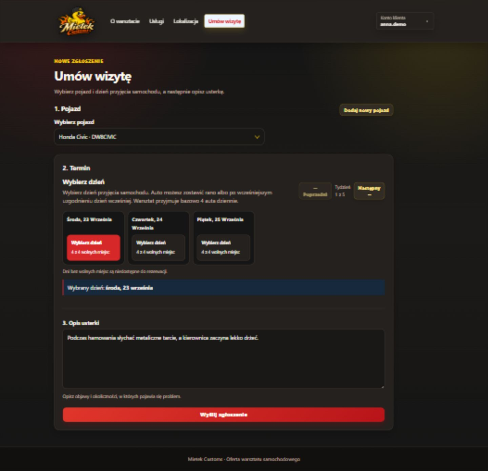
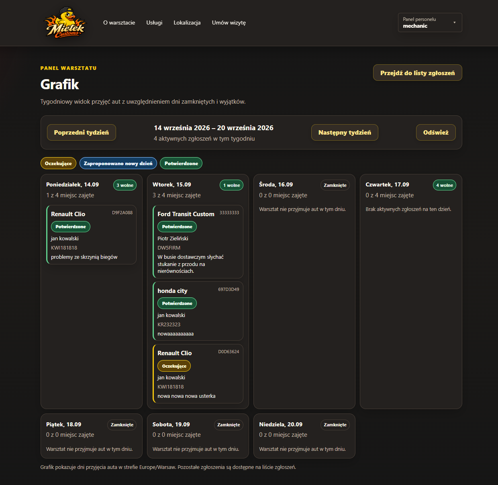
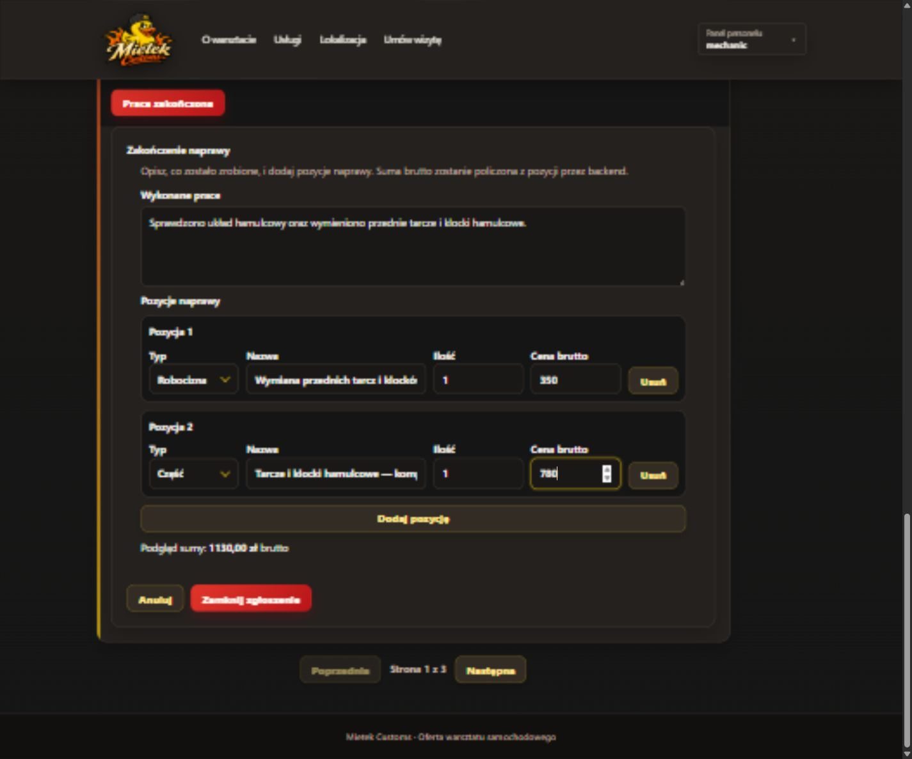
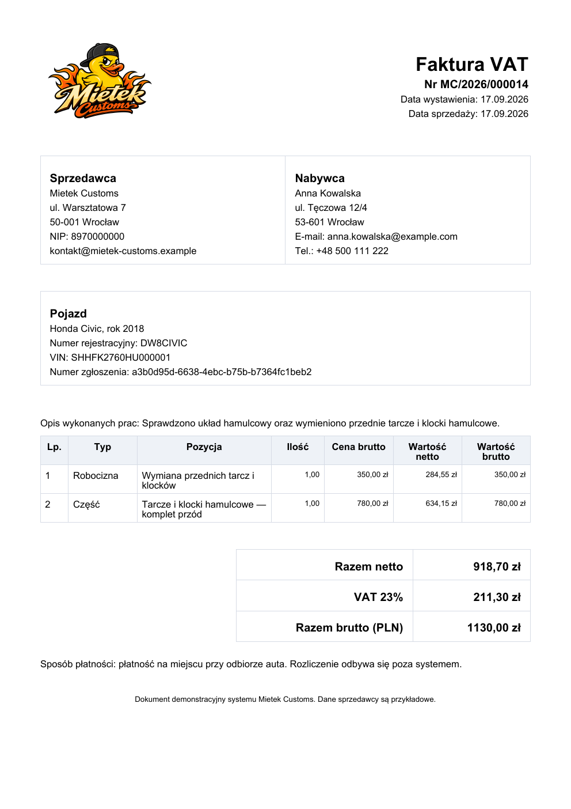
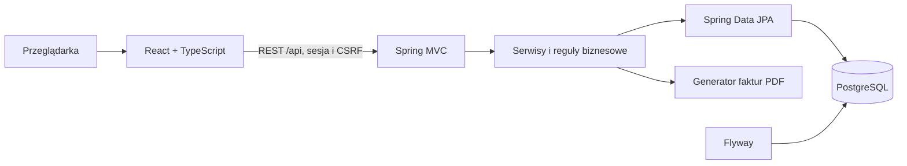

# Mietek Customs — system obsługi warsztatu samochodowego

<p align="center">
  
</p>

Pełnostackowa aplikacja portfolio do obsługi warsztatu samochodowego. Klient może
zarządzać pojazdami i umawiać wizyty, mechanik prowadzi naprawę od przyjęcia auta
do odbioru, a administrator konfiguruje grafik i zarządza kontami użytkowników.

Projekt pokazuje praktyczne użycie Spring Boota, relacyjnej bazy danych,
bezpieczeństwa sesyjnego, transakcji, testów integracyjnych oraz Reacta z TypeScriptem.

**Na skróty:** [Funkcje](#funkcje) · [Przepływ aplikacji](#jak-działa-aplikacja) ·
[Technologie](#technologie) · [Architektura](#architektura) ·
[Uruchomienie](#uruchomienie) · [Konta demo](#konta-demonstracyjne) ·
[Decyzje i ograniczenia](#decyzje-i-ograniczenia) · [Dokumentacja](#dokumentacja)

## Funkcje

| Rola | Możliwości |
| --- | --- |
| Klient | Profil prywatny lub firmowy, własne pojazdy, rezerwacje, historia napraw i faktury PDF |
| Gość | Zgłoszenie wizyty bez zakładania konta |
| Mechanik | Tygodniowy grafik, obsługa zgłoszeń, robocizna i części, zakończenie naprawy i odbiór auta |
| Administrator | Funkcje mechanika, konfiguracja grafiku oraz zarządzanie kontami klientów i personelu |

Dodatkowo aplikacja udostępnia publiczny katalog usług warsztatu zarządzany przez
mechanika lub administratora.

## Jak działa aplikacja?

Przykładowy scenariusz: klient zgłasza problem z hamulcami, warsztat przyjmuje auto,
wykonuje naprawę, a po odbiorze klient otrzymuje wpis w historii pojazdu i fakturę PDF.

**Zgłoszenie → potwierdzenie → naprawa → odbiór i faktura**

### 1. Klient zgłasza wizytę

Klient wybiera własny pojazd, dostępny dzień przyjęcia auta i opisuje usterkę.
Zgłoszenie otrzymuje status „Oczekuje na decyzję” (`PENDING`). Backend ponownie
sprawdza dostępność dnia podczas zapisu, aby nie przekroczyć limitu przyjęć.

> **Miejsce na screen:** formularz „Umów wizytę” z wybranym pojazdem, dniem i opisem usterki.
<!-- Po dodaniu pliku zastąp powyższy placeholder:

-->

### 2. Mechanik potwierdza termin

Mechanik widzi zgłoszenie w grafiku i otwiera jego szczegóły. Może je potwierdzić
(`CONFIRMED`), odrzucić albo zaproponować inny dzień. Propozycję nowego dnia
zalogowany klient zatwierdza w zakładce „Moje wizyty”.

> **Miejsce na screen:** tygodniowy grafik mechanika ze zgłoszeniem opisywanego pojazdu.
<!-- Po dodaniu pliku zastąp powyższy placeholder:

-->

### 3. Warsztat zapisuje wykonaną naprawę

Mechanik wpisuje opis wykonanych prac oraz pozycje robocizny i części. Backend
wylicza kwotę naprawy, a zgłoszenie przechodzi do „Czeka na odbiór” (`READY_FOR_PICKUP`).
Klient widzi podsumowanie prac i kwotę do zapłaty na miejscu.

> **Miejsce na screen:** formularz zakończenia naprawy z opisem, robocizną i częściami.
<!-- Po dodaniu pliku zastąp powyższy placeholder:

-->

### 4. Klient odbiera auto i pobiera fakturę

Personel oznacza samochód jako odebrany (`COMPLETED`). Naprawa pojawia się w historii
pojazdu, skąd klient pobiera fakturę PDF z pozycjami oraz wartościami netto i brutto.
Dokument jest zapisany przy odbiorze i zachowuje dane mimo późniejszej edycji profilu.
Dane nabywcy są imienne lub firmowe, zależnie od uzupełnionego profilu.



## Technologie

- **Backend:** Java 25, Spring Boot 4.1.1, Spring MVC, Spring Data JPA, Spring Security
- **Baza danych:** PostgreSQL 17, Hibernate, Flyway
- **Frontend:** React 19.2.8, TypeScript 6.0.2, Vite 8.2.2, React Router 7.18.3
- **Testy:** JUnit 5, MockMvc, AssertJ, Testcontainers
- **Narzędzia:** Maven, Docker Compose, GitHub Actions, springdoc-openapi 3.1.1, OpenPDF 2.4.0

## Architektura



Backend jest monolitem podzielonym na pakiety funkcjonalne. Uwierzytelnianie
korzysta z sesji Spring Security i ciasteczka HttpOnly, a operacje zmieniające dane
wymagają tokenu CSRF.

## Najciekawsze elementy techniczne

- Właściciel profilu, pojazdu i zgłoszenia wynika z uwierzytelnionej sesji.
- Role `CLIENT`, `MECHANIC` i `ADMIN` są egzekwowane przez backend.
- Transakcyjne blokady chronią limit przyjęć przed równoczesnymi rezerwacjami i zmianami konfiguracji grafiku.
- Listy wizyt i kont mają backendową paginację, filtrowanie i sortowanie.
- Flyway wersjonuje bazę, a profil `local` idempotentnie tworzy dane demonstracyjne.
- Faktura PDF zawiera pozycje robocizny i części oraz wartości netto i brutto.
- API używa wspólnego formatu błędów ze stabilnymi kodami technicznymi.
- Testy integracyjne korzystają z odizolowanego PostgreSQL przez Testcontainers.

## Decyzje i ograniczenia

Projekt jest modularnym monolitem. Sesje Spring Security z CSRF pasują do jednej
aplikacji webowej i nie wymagają JWT. Backend pozostaje źródłem prawdy dla uprawnień,
pojemności grafiku, kwot oraz utrwalonych danych faktury. Rezerwacja dotyczy dnia,
a blokady transakcyjne chronią limit przy równoczesnych żądaniach.

Wersja portfolio działa lokalnie przez Docker Compose. Nie obejmuje HTTPS, wdrożenia
produkcyjnego, płatności online, korekt księgowych, powiadomień e-mail/SMS,
automatycznego odzyskiwania hasła ani przydzielania zleceń do konkretnych mechaników.
Publiczny formularz nie ma jeszcze limitowania nadużyć. Faktury są dokumentami
demonstracyjnymi, a dane sprzedawcy i lokalizacja warsztatu są przykładowe.

## Roadmapa

Podstawowy zakres portfolio jest domknięty. Dalszy rozwój może objąć przygotowanie
wdrożenia z HTTPS i sekretami poza profilem `local`, ochronę publicznych formularzy,
powiadomienia, obserwowalność oraz rozbudowę planowania pracy warsztatu. Pełna
księgowość i płatności pozostają osobnymi integracjami, a nie częścią obecnej wersji.

## Uruchomienie

Wymagany jest Docker Desktop z kontenerami Linux i Docker Compose w wersji co
najmniej 2.20.3.

```powershell
docker compose up --build -d --wait
```

| Element | Adres |
| --- | --- |
| Aplikacja | http://localhost:5173 |
| Swagger UI | http://localhost:8080/swagger-ui.html |
| Stan backendu | http://localhost:8080/api/health |

Zatrzymanie aplikacji:

```powershell
docker compose down
```

## Konta demonstracyjne

Profil Springa `local`, włączony w Docker Compose, przygotowuje następujące konta:

| Login | Hasło | Rola |
| --- | --- | --- |
| `anna.demo` | `client-local-2026` | Klient z pojazdami, wizytami i fakturą |
| `firma.demo` | `client-local-2026` | Klient firmowy z fakturą na firmę |
| `mechanic` | `mechanic-local-2026` | Mechanik |
| `admin` | `admin-local-2026` | Administrator |

Konta i hasła służą wyłącznie do lokalnej prezentacji aplikacji.

## Weryfikacja

GitHub Actions przy każdym pushu i pull requeście do `main` wykonuje:

- testy backendu z Testcontainers,
- testy zachowania frontendu (Vitest i React Testing Library), lint i produkcyjny build,
- sprawdzenie konfiguracji Docker Compose.

Po nieudanym zadaniu CI publikuje raporty testów backendu lub frontendu jako artefakty
przebiegu. Pełny scenariusz klient → mechanik → faktura i wyniki lokalnej weryfikacji
opisuje [raport prezentacyjny](docs/portfolio-verification.md).

## Dokumentacja

Pełne instrukcje uruchamiania, opis modułów, tabela endpointów API oraz materiały
do nauki znajdują się w [rozszerzonej dokumentacji projektu](docs/README.md).

Swagger UI po uruchomieniu aplikacji: http://localhost:8080/swagger-ui.html
