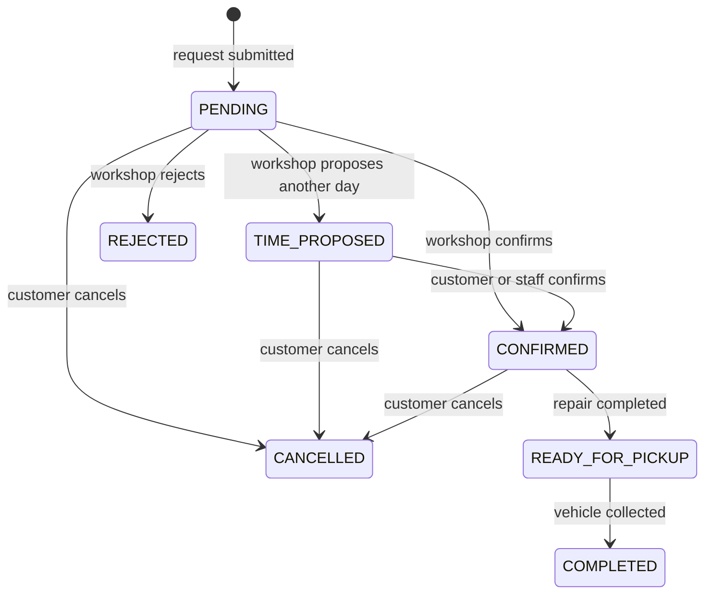
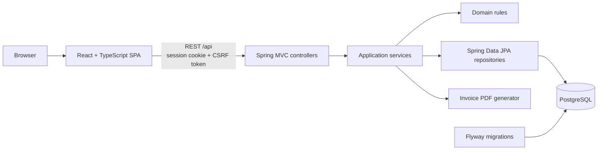

# Mietek Customs — Car Workshop Management System

<p align="center">
  
</p>

Mietek Customs is a full-stack application that supports the complete service process
of a car workshop: from an appointment request, through workshop approval and repair,
to vehicle pickup, repair history, and a PDF invoice.

The project was built as a portfolio application focused on backend development in Java.
It demonstrates business-rule modelling, authorization, transactional consistency,
concurrent booking protection, database migrations, integration tests, and a React client
written in TypeScript.

> The application interface is in Polish because the system represents a Polish car
> workshop. Source code, API contracts, database objects, and technical identifiers use
> English naming.

## What the application does

The system supports four ways of using the workshop:

| User | Available operations |
| --- | --- |
| Guest | Browse workshop services and submit an appointment request without creating an account |
| Customer | Maintain a profile, manage owned vehicles, request appointments, track their status, browse repair history, and download invoices |
| Mechanic | Review incoming requests, manage the weekly schedule, record labor and parts, complete repairs, and confirm vehicle pickup |
| Administrator | Use mechanic features, configure workshop capacity and opening days, and manage customer, mechanic, and administrator accounts |

The public service catalog is divided into categories such as mechanics, electrical
services, and tire services. Mechanics and administrators can manage categories and
individual services.

## Application flow

The screenshots below show one complete business scenario using the records created by
the local demo-data profile.

### 1. The customer requests an appointment

A logged-in customer selects one of their vehicles, chooses an available drop-off day,
and describes the problem. A guest can submit the same type of request by providing
vehicle and contact details without creating an account.

The new request receives the `PENDING` status. Availability shown in the calendar is
informational; the backend verifies capacity again while saving the request.


### 2. The workshop reviews the request

Mechanics see active requests in a weekly schedule. Each day displays its configured
capacity and the appointments that currently occupy it.

Staff can:

- confirm the requested day,
- reject the request,
- propose another available day.

When a new day is proposed, a logged-in customer confirms it from their appointment
panel. Guest arrangements are confirmed by staff after contacting the guest outside the
application.


### 3. The mechanic completes the repair

After repairing a confirmed vehicle, the mechanic records a summary of the work and adds
separate repair items. Every item is classified as labor or a part and contains quantity,
unit, VAT rate, and unit net price.

The backend calculates line totals and the final net, VAT, and gross amounts. Completing
the repair changes the status to `READY_FOR_PICKUP`.


### 4. The vehicle is picked up

Staff marks the vehicle as collected after the customer arrives at the workshop. The
appointment changes to `COMPLETED` and becomes part of the vehicle's repair history.
Payment takes place at the workshop and is outside the application.

At pickup, the system persists an invoice snapshot containing:

- workshop and customer data,
- vehicle details,
- labor and part items,
- net, VAT, and gross totals,
- issue and sale dates,
- the generated PDF document.

Persisting the snapshot means that later edits to a customer profile, vehicle, logo, or
prices cannot change an already issued document.


## Appointment lifecycle



Status changes are protected by business rules in the backend. For example, a repair can
only be completed from `CONFIRMED`, and only a `READY_FOR_PICKUP` appointment can be
marked as collected.

## Technical architecture



The project is a modular monolith. Backend packages are grouped by business capability,
including accounts, appointments, vehicles, workshop schedule, service catalog, and
invoices. This keeps related controllers, use cases, persistence code, and domain rules
close together without introducing the deployment overhead of microservices.

The React application consumes the REST API and uses routes for public, customer, staff,
and administration views. In local development Vite proxies API requests to Spring Boot.
The production Compose variant serves the built frontend through Nginx and exposes the
application through Caddy.

## Important backend mechanisms

### Authentication and authorization

- Spring Security uses server-side sessions and BCrypt password hashes.
- State-changing requests require CSRF protection.
- The backend enforces `CLIENT`, `MECHANIC`, and `ADMIN` permissions.
- Ownership of profiles, vehicles, appointments, and invoices comes from the authenticated
  account ID instead of an ID supplied by the browser.
- Requests for another customer's resources return `404` to avoid disclosing their
  existence.
- Password changes and administrative resets invalidate older sessions according to the
  account security rules.

### Booking consistency

The workshop has a configurable default daily capacity, booking horizon, working hours,
and per-day exceptions. An administrator can close a selected day or assign a custom
capacity.

The backend does not trust calendar data previously loaded by the browser. It checks the
selected day again inside the write transaction. PostgreSQL locking protects daily
capacity when multiple customers submit requests at the same time. Moving an appointment
releases the old day and reserves the new one atomically.

### Data snapshots

Customer contact details and vehicle information are copied into an appointment when it
is submitted. Later profile or vehicle edits therefore do not change the information
that the workshop originally received.

Invoice documents follow the same principle. The final invoice data and PDF are stored as
an immutable snapshot rather than generated from the customer's current profile on every
download.

### API design

- REST endpoints use request and response DTOs instead of exposing JPA entities.
- Bean Validation handles input validation.
- API errors have a consistent response structure and stable technical error codes.
- Customer appointments, staff appointments, and administrative account lists support
  backend pagination, filtering, and sorting.
- Swagger UI documents the API in the local environment.

## Technology stack

| Area | Technologies |
| --- | --- |
| Backend | Java 25, Spring Boot 4.1.1, Spring MVC, Spring Data JPA, Spring Security |
| Database | PostgreSQL 17, Hibernate, Flyway |
| Frontend | React 19.2.8, TypeScript 6.0.2, Vite 8.2.2, React Router 7.18.3 |
| PDF | OpenPDF 2.4.0 |
| API documentation | springdoc-openapi 3.1.1 |
| Backend testing | JUnit/Jupiter, MockMvc, AssertJ, Testcontainers |
| Frontend testing | Vitest, React Testing Library |
| Tooling | Maven, Docker Compose, GitHub Actions |

## Running the project

Requirements:

- Docker Desktop using Linux containers
- Docker Compose 2.20.3 or newer

Start the complete application from the repository root:

```powershell
docker compose up --build -d --wait
```

| Component | Address |
| --- | --- |
| Web application | http://localhost:5173 |
| Swagger UI | http://localhost:8080/swagger-ui.html |
| Backend health endpoint | http://localhost:8080/api/health |

Stop the containers while preserving the PostgreSQL volume:

```powershell
docker compose down
```

## Local demo accounts

The default Docker Compose configuration runs Spring Boot with the `local` profile. It
creates presentation data idempotently and provides the following accounts:

| Username | Password | Role and sample data |
| --- | --- | --- |
| `anna.demo` | `client-local-2026` | Customer with vehicles, appointments, repair history, and an invoice |
| `firma.demo` | `client-local-2026` | Company customer with company billing data |
| `mechanic` | `mechanic-local-2026` | Mechanic |
| `admin` | `admin-local-2026` | Administrator |

These credentials are intended only for local demonstration.

## Testing and continuous integration

The automated test suite covers business rules, resource ownership, security boundaries,
appointment capacity, concurrent booking attempts, schedule changes, repair totals, and
invoice persistence.

GitHub Actions runs the following checks for pushes and pull requests to `main`:

- backend tests against PostgreSQL provided by Testcontainers,
- frontend tests and linting,
- frontend production build,
- validation of local and production Docker Compose files.

The latest verified project state contains **146 backend tests** and **22 frontend tests**.

## Current scope

The completed portfolio scope covers the workshop process from appointment request to a
persisted invoice. Online payments, full accounting corrections, e-mail/SMS notifications,
automatic password recovery, rate limiting for the guest form, and assigning work to
individual mechanics are outside the current version.
