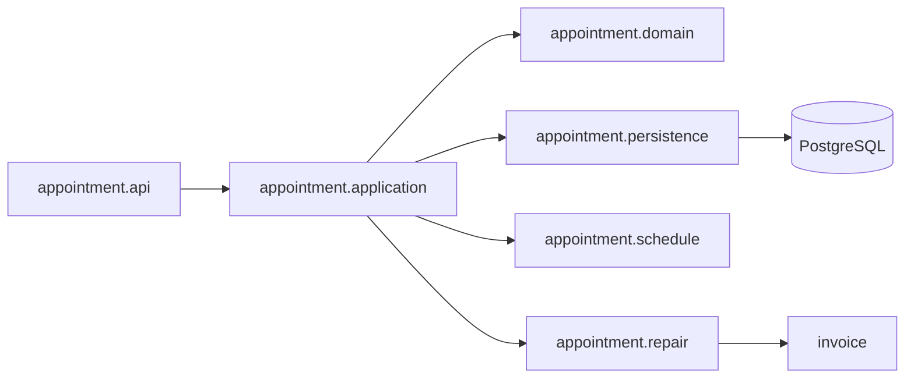

# Audyt jakości kodu backendu

Data audytu: 19.09.2026  
Zakres: `backend/src/main/java` i organizacja testów backendu.

## Wniosek

Backend ma dobre fundamenty projektu portfolio: kod jest pogrupowany według funkcji,
kontrolery nie zwracają encji JPA, operacje zapisu mają granice transakcji, baza jest
wersjonowana przez Flyway, a najważniejsze reguły dostępu i współbieżności pokrywają
testy integracyjne z PostgreSQL.

W momencie audytu największym problemem utrzymaniowym był pakiet `appointment`. Zawierał 42 pliki:
23 w pakiecie głównym i 19 w jednym wspólnym `dto`. Łączy rezerwowanie terminu,
obsługę statusów, konfigurację grafiku, widok grafiku personelu, wykonanie naprawy,
historię napraw i pobieranie faktur. `AppointmentService` miał 377 linii, jedenaście
zależności konstruktora i szesnaście publicznych operacji. Jego podział był
uzasadniony zasadą pojedynczej odpowiedzialności i ułatwi znalezienie kodu.

Nie zalecam przepisywania backendu ani wprowadzania mikroserwisów. Najbezpieczniejsza
będzie refaktoryzacja istniejącego monolitu małymi krokami, bez zmiany endpointów,
schematu bazy i zachowania aplikacji.

## Co już jest dobre

- Pakiety najwyższego poziomu odpowiadają funkcjom aplikacji: `appointment`,
  `invoice`, `vehicle`, `profile`, `offering`, `user`, `auth` i `security`.
- Kontrolery zajmują się protokołem HTTP, a reguły biznesowe znajdują się głównie
  w serwisach i encjach.
- DTO oddzielają kontrakt API od modelu JPA.
- `AccountPrincipal` przenosi niezmienne ID użytkownika, dzięki czemu własność danych
  nie zależy od edytowalnego loginu.
- Blokady grafiku i dnia rezerwacji chronią limit miejsc przed równoczesnymi zapisami.
- Stabilne kody błędów tworzą użyteczny kontrakt pomiędzy backendem i frontendem.
- 129 testów backendu obejmuje między innymi role, CSRF, własność danych, faktury,
  sesje i rzeczywistą współbieżność na PostgreSQL.

Te elementy należy zachować podczas porządkowania kodu.

## Najważniejsze problemy

### 1. `AppointmentService` ma zbyt wiele powodów do zmiany

Klasa jednocześnie:

- tworzy zgłoszenia klienta i gościa,
- pobiera listy klienta oraz personelu,
- obsługuje decyzje personelu i klienta,
- waliduje dane gościa i pozycje naprawy,
- mapuje encje do kilku rodzajów DTO,
- pobiera historię napraw,
- kończy naprawę i zleca utrwalenie faktury.

Zmiana paginacji, formularza gościa, statusów albo fakturowania wymaga obecnie edycji
tej samej klasy. To jest naruszenie SRP, które ma praktyczny koszt: rośnie ryzyko
konfliktów i coraz trudniej ustalić, gdzie znajduje się dana reguła.

**Priorytet: wysoki.** Najpierw należy rozdzielić zachowania na usługi aplikacyjne,
a dopiero później przenosić pliki do nowych pakietów.

### 2. Granice domeny zgłoszenia, grafiku i naprawy są niewyraźne

`AppointmentSchedule` oblicza publiczną dostępność, normalizuje dzień wizyty,
odczytuje zajętość i zna konfigurację warsztatu. W tym samym pakiecie znajdują się
encje ustawień grafiku, wyjątki dni, blokady, DTO panelu administratora i DTO grafiku
mechanika. Nazwa `AppointmentSchedule` sugeruje pojedynczy grafik, chociaż klasa
pełni rolę serwisu dostępności warsztatu.

Elementy naprawy również są rozproszone. `AppointmentRepairItem`, `RepairAmounts`
i walidacja pozycji znajdują się w `appointment`, natomiast wspólne DTO historii
napraw leży w `vehicle`, mimo że korzysta z niego również panel personelu.

**Priorytet: wysoki.** Grafik powinien otrzymać własny podpakiet, a historia i workflow
naprawy jednego właściciela w kodzie.

### 3. Reguły przejść statusów nie są chronione przez sam model domenowy

Serwis przed wywołaniem `accept`, `completeRepair` albo `markPickedUp` sprawdza
oczekiwany status. Metody encji ustawiają jednak nowy status bez sprawdzenia, czy
przejście jest dozwolone. Inny kod może więc ominąć regułę przez bezpośrednie
wywołanie metody encji; robią to już dane demonstracyjne i część testów.

Encja powinna pilnować własnych niezmienników, na przykład:

- `accept` dopuszcza tylko `PENDING → CONFIRMED`,
- `completeRepair` dopuszcza tylko `CONFIRMED → READY_FOR_PICKUP`,
- `markPickedUp` dopuszcza tylko `READY_FOR_PICKUP → COMPLETED`,
- anulowanie dopuszcza wyłącznie aktywne statusy.

Serwis nadal odpowiada za autoryzację, pobranie rekordu z blokadą, dostępność dnia
i transakcję. Dzięki temu model chroni reguły niezależnie od punktu wywołania.

**Priorytet: wysoki.** Zmianę trzeba zabezpieczyć testami jednostkowymi macierzy
dozwolonych i zabronionych przejść.

### 4. Powtarzające się mapowanie i walidacja

Konkretne przykłady naruszenia DRY:

- `AppointmentService` i `VehicleService` zawierają niemal identyczne mapowanie
  zakończonego zgłoszenia oraz pozycji do `RepairHistoryEntryResponse`.
- Rejestracja, tworzenie kont przez administratora i zmiana hasła osobno sprawdzają
  limit 72 bajtów BCrypt oraz zgodność powtórzonego hasła.
- Rejestracja i panel administratora osobno normalizują login oraz e-mail.
- Walidacja rocznika, numeru rejestracyjnego i VIN-u występuje w obsłudze pojazdu
  klienta oraz zgłoszenia gościa.
- Budowanie `PageRequest` i `AppointmentPageResponse` jest powtórzone dla listy
  klienta i personelu.

Nie każdą podobną linię trzeba przenosić do klasy `Utils`. Warto wydzielać nazwane
reguły biznesowe: `AccountCredentialsPolicy`, `VehicleDataNormalizer`,
`AppointmentPageRequest` i `RepairHistoryMapper`. Nazwa ma wyjaśniać znaczenie,
a nie tylko ukrywać wspólny kod.

**Priorytet: średni.** Najpierw należy usunąć duplikację mapowania historii, bo obecnie
łączy ona pakiety `appointment` i `vehicle` w obu kierunkach.

### 5. Czas systemowy jest ukrytą zależnością

`AppointmentService`, `AppointmentSchedule`, `WorkshopScheduleConfigService` oraz
`VehicleService` wywołują bezpośrednio `Instant.now()`, `LocalDate.now()`,
`ZonedDateTime.now()` albo `Year.now()`. Faktury korzystają już z wstrzykiwanego
`Clock`, co jest lepszym wzorcem.

Jeden bean `Clock` ustawiony na `Europe/Warsaw` powinien być używany w całym
backendzie. Test może wtedy podać zegar stały i deterministycznie sprawdzić granicę
dnia, horyzont rezerwacji, rok produkcji oraz znaczniki czasu akcji.

**Priorytet: średni.** Ta zmiana uprości późniejsze testy jednostkowe usług.

### 6. Obsługa błędów ma rosnący kod szablonowy

`GlobalExceptionHandler` ma osobne metody dla wielu wyjątków, które zwracają ten sam
kształt odpowiedzi i różnią się głównie kodem oraz statusem HTTP. Rozsądne jest
wprowadzenie jednej bazowej klasy, na przykład `ApiException`, zawierającej
`HttpStatus`, `ApiErrorCode`, komunikat i błędy pól. Wyjątki funkcjonalne mogą po niej
dziedziczyć, a handler obsłuży je jedną metodą.

Nie należy przy tym usuwać stabilnych kodów błędów ani zastępować wszystkich wyjątków
jednym ogólnym `RuntimeException`.

**Priorytet: średni.** Warto wykonać po podziale `appointment`, aby nie mieszać dwóch
dużych rodzajów zmian w jednym commicie.

### 7. Testy dobrze chronią zachowanie, ale część plików jest zbyt szeroka

`AppointmentIntegrationTest` ma 868 linii i testuje konfigurację grafiku, rezerwacje,
workflow personelu, paginację, naprawy, uprawnienia i CSRF. Podobnie jak produkcyjny
serwis ma wiele powodów do zmiany.

Po wydzieleniu usług test warto rozdzielić na:

- `AppointmentAvailabilityIntegrationTest`,
- `AppointmentBookingIntegrationTest`,
- `ClientAppointmentIntegrationTest`,
- `StaffAppointmentWorkflowIntegrationTest`,
- `RepairWorkflowIntegrationTest`,
- `AppointmentAuthorizationIntegrationTest`.

Testy współbieżności powinny pozostać osobne. Ich logiki nie należy upraszczać tylko
po to, aby skrócić pliki.

**Priorytet: średni.** Podział testów należy wykonywać razem z odpowiadającymi im
usługami, zachowując wszystkie istniejące przypadki.

### 8. Drobniejsze kwestie czytelności

- Importy z gwiazdką utrudniają ocenę zależności klas; warto je wyeliminować przy
  edycji danego pliku.
- `StaffAppointmentController` łączy listę, szczegóły, grafik, historię, fakturę
  i komendy zmiany statusu. Po podziale usług można rozdzielić go na kontroler
  zapytań, komend i grafiku, zachowując obecne adresy API.
- `AppointmentRepository` obsługuje CRUD, paginację, historię, projekcję grafiku,
  liczenie zajętości i blokady. Nie wymaga natychmiastowego podziału, ale po
  ustabilizowaniu usług można wydzielić własne fragmenty repozytorium dla zapytań
  grafiku oraz blokad.
- Nie ma potrzeby tworzenia interfejsu dla każdego serwisu. DIP warto stosować na
  prawdziwych granicach, na przykład źródle czasu, generatorze dokumentu albo źródle
  zajętości grafiku. Interfejs z jedną implementacją bez potrzeby podmiany zwiększa
  liczbę plików, ale nie poprawia projektu.

## Proponowana struktura pakietu `appointment`

Poniższy podział zachowuje jeden moduł funkcjonalny i grupuje klasy według roli:

```text
pl.autoserwis.appointment
├── api
│   ├── ClientAppointmentController
│   ├── StaffAppointmentController
│   └── dto
├── application
│   ├── AppointmentBookingService
│   ├── ClientAppointmentService
│   ├── StaffAppointmentService
│   ├── AppointmentQueryService
│   └── AppointmentResponseMapper
├── domain
│   ├── AppointmentRequest
│   ├── AppointmentRepairItem
│   ├── AppointmentStatus
│   ├── AppointmentRequesterType
│   ├── RepairAmounts
│   ├── RepairItemDraft
│   └── RepairItemType
├── persistence
│   └── AppointmentRepository
├── repair
│   ├── RepairWorkflowService
│   ├── RepairHistoryService
│   ├── RepairHistoryMapper
│   └── dto
└── schedule
    ├── api
    ├── application
    ├── domain
    └── persistence
```

`VehicleService` powinien wtedy obsługiwać wyłącznie katalog pojazdów. Kontroler
pojazdów może używać `RepairHistoryService` do historii i faktur. Dzięki temu DTO
historii nie należy sztucznie do pakietu `vehicle`, a ten pakiet przestaje zależeć
od szczegółów zgłoszeń.



## Kolejność refaktoryzacji

### Etap 7A — przygotowanie bez przenoszenia pakietów

- [x] Wprowadzić wspólny `Clock` dla czasu warsztatu.
- [x] Wydzielić `AppointmentResponseMapper` i `RepairHistoryMapper`.
- [x] Przenieść mapowanie historii z `VehicleService` i `AppointmentService`.
- [x] Wydzielić walidację pozycji naprawy do nazwanej klasy domenowej.
- [x] Dodać testy jednostkowe nowych klas bez usuwania testów integracyjnych.

Status: zakończony 19.09.2026. `TimeConfiguration` udostępnia jeden zegar w strefie
`Europe/Warsaw`, używany przez zgłoszenia, grafik, pojazdy, faktury i dane demo.
Mapowanie odpowiedzi obsługują `AppointmentResponseMapper`, `RepairHistoryMapper`
i `RepairItemResponseMapper`, a `RepairItemValidator` odpowiada za normalizację
pozycji naprawy. Dodano 6 testów jednostkowych; pełny wynik backendu to 135/135.

### Etap 7B — podział `AppointmentService`

- [x] Wydzielić odczyty i paginację do `AppointmentQueryService`.
- [x] Wydzielić tworzenie zgłoszeń do `AppointmentBookingService`.
- [x] Wydzielić decyzje i propozycje terminów do `StaffAppointmentService`.
- [x] Wydzielić zakończenie naprawy i odbiór do `RepairWorkflowService`.
- [x] Umieścić reguły przejść statusów w modelu domenowym.
- [x] Zachować transakcje, kolejność blokad i obecne endpointy.

Status: zakończony 20.09.2026. Usunięty `AppointmentService` zastąpiło pięć
serwisów przypadków użycia: rezerwacje, zapytania, operacje klienta, decyzje
personelu i obsługa napraw. Kontrolery zachowały dotychczasowe adresy oraz DTO.
Encja `AppointmentRequest` odrzuca niedozwolone przejścia statusów także wtedy,
gdy zostanie użyta poza aktualnym kontrolerem. Dodano 5 testów jednostkowych
cyklu życia zgłoszenia; pełny wynik backendu to 140/140.

### Etap 7C — uporządkowanie pakietów i testów

- [x] Przenieść klasy do `api`, `application`, `domain`, `persistence`, `repair`
  oraz `schedule`.
- [x] Podzielić DTO według obsługiwanego obszaru.
- [x] Rozdzielić duży test integracyjny według przypadków użycia.
- [x] Usunąć importy z gwiazdką w zmienianych plikach.
- [x] Ocenić test ArchUnit pilnujący kierunku zależności pakietów. Nie dodawać nowej
  zależności, dopóki reguły między pakietami nie będą wymagały osobnego zabezpieczenia.

Status: zakończony 22.09.2026. Kod produkcyjny modułu `appointment` jest podzielony
na obszary, a DTO należą do obsługiwanych endpointów. Dawny test integracyjny o 868
liniach zastąpiło sześć klas według przypadków użycia i wspólna klasa przygotowująca
dane. Testy współbieżności pozostały osobne, a importy zmienianych testów są jawne.
Nie zmieniono adresów HTTP, JSON-u ani schematu bazy. Pełny zestaw backendu nadal
przechodzi: 140/140 testów.

### Etap 8 — wspólne reguły backendu

- [ ] Wydzielić `AccountCredentialsPolicy` dla loginu, e-maila i haseł.
- [ ] Wydzielić `VehicleDataNormalizer` używany przez pojazdy i zgłoszenie gościa.
- [ ] Ujednolicić bazowe wyjątki API i uprościć `GlobalExceptionHandler`.
- [ ] Ocenić podział `AppointmentRepository` dopiero po ustabilizowaniu usług.

## Kryteria bezpieczeństwa refaktoryzacji

Każdy etap powinien spełniać wszystkie poniższe warunki:

1. Adresy endpointów, statusy HTTP i DTO pozostają zgodne z obecnym frontendem.
2. Migracje i schemat bazy nie zmieniają się podczas samego porządkowania kodu.
3. Kolejność blokad pozostaje: konfiguracja → zgłoszenie → docelowy dzień.
4. Testy współbieżności nadal korzystają z prawdziwego PostgreSQL.
5. Po każdym małym kroku przechodzi pełne `mvn test`.
6. Przeniesienie plików nie jest łączone w jednym commicie ze zmianą zachowania.

## Czego obecnie nie warto dodawać

- mikroserwisów,
- osobnych interfejsów dla każdej klasy serwisowej,
- ogólnego pakietu `utils` na przypadkowe metody,
- pełnego CQRS lub event sourcingu,
- nowego frameworka architektonicznego tylko w celu zmiany nazw folderów.

Obecny monolit jest odpowiedni dla skali projektu. Celem jest czytelny monolit
modułowy, w którym nazwa pakietu i klasy szybko prowadzi do właściwego przypadku
użycia.
